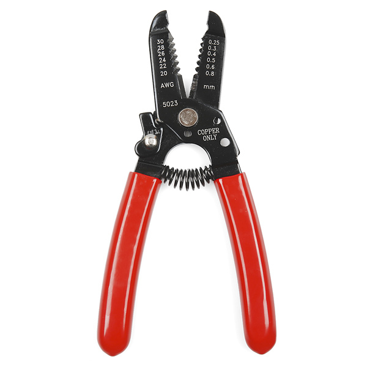

<h1>Wire Stripping</h1>

### What is it?
Wire Stripping is the act of stripping the insulation off of a wire to reveal the conductor underneath. After this is done, the exposed wire can then be used for other things, such as being soldered to other wires or components or crimped into a connector.

### How to do it
First you will need a Wire Stripper. We have a few and most look like this:

To use them, choose the spot that is labelled with the gauge of wire you have, close it in on the wire, and pull. The insulation should come off. The various wire threads will be frayed though, so to keep them together you should twist them together. The direction does not matter, just that each end is only twisted in one direction.